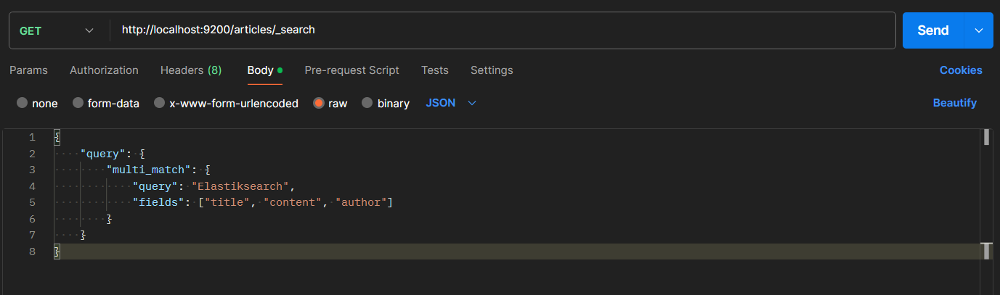

<h1> TEST WITH ELASTCSEARCH API</h1>

<h2>Save Article</h2>

<h2>Save Response</h2>

<h2>Save Document 1</h2>

<h2>Save Document 1 Response</h2>

<h2>Save Document 2</h2>

<h2>Save Document 2 Response</h2>

<h2>Search</h2>
<h5>Search Elasticsearch<h5>

<h5>Search Spring Boot<h5>

<h2>Search Response</h2>
<h5>Search Elasticsearch Response<h5>

<h5>Search Spring Boot Response<h5>

<h1>------------------------------------------------------------------------------ </h1>
<h2>Save Logs</h2>

<h2>Save Response</h2>

<h2>Save Document 1</h2>

<h2>Save Document 1 Response</h2>

<h2>Save Document 2</h2>

<h2>Save Document 2 Response</h2>

<h2>Search</h2>
<h5>Search by Log Level<h5>

<h5>Search by Hour and Date<h5>

<h5>Calculate Statistics on Log Message Length</h5>

<h2>Search Response</h2>
<h5>Search With Log Level Response<h5>

<h5>Search With Hour and Date Response<h5>

<h5>Calculate Statistics on Log Message Length Response</h5>

